# Visual Architecture: The 100X Growth Engine

```mermaid
graph TD
    %% Define Styles
    classDef trigger fill:#f9f,stroke:#333,stroke-width:2px;
    classDef process fill:#bbf,stroke:#333,stroke-width:2px;
    classDef decision fill:#ff9,stroke:#333,stroke-width:2px;
    classDef output fill:#bfb,stroke:#333,stroke-width:2px;
    classDef ai fill:#f96,stroke:#333,stroke-width:4px,color:white;

    %% Ingestion
    Lead[👤 New Lead]:::trigger -->|Web/FB/Google| Webhook(⚡ Webhook Listener):::process
    Webhook --> Normalizer(🔄 Normalize Data):::process
    
    %% Enrichment Layer
    Normalizer --> Enrichment{🔍 Enrich Data?}:::decision
    Enrichment -->|Yes| Apollo(🚀 Apollo/Clearbit API):::ai
    Enrichment -->|No| CRM
    Apollo -->|Risk/Revenue Data| CRM[(💾 CRM Sync)]:::process
    
    %% AI Voice Speed-to-Lead
    CRM -->|Qualify| VoiceAI{🤖 Trigger AI Call?}:::decision
    VoiceAI -->|High Ticket| Retell(📞 Retell AI Agent):::ai
    VoiceAI -->|Standard| SMS(💬 SMS Sequence):::process
    
    %% Outcomes
    Retell -->|Booked| Calendar(kv Calendar Event):::output
    Retell -->|No Answer| SMS_Fallback(💬 Send Fallback SMS):::process
    
    %% Notification
    CRM --> Slack(🔔 Slack Alert):::output
    Slack -- "Contains: Name, Title, Rev, LinkedIn" --> Rep(👨‍💼 Sales Rep)
    
    %% Backup Watchdog
    CRM --> Watchdog(⏳ 15m Watchdog):::process
    Watchdog -->|No Activity?| Manager(🚨 Alert Manager):::output
```

## How to Present This
1.  **"The Old Way":** Draw a line from Lead -> Email -> Wait 5 Hours -> Call -> No Answer. (Depressing).
2.  **"The New Way":** Show this diagram. Highlight the **Orange (AI)** blocks.
3.  **The Hook:** *"We insert an Artificial Intelligence layer between the form and your CRM. It researches the lead and calls them for you."*
