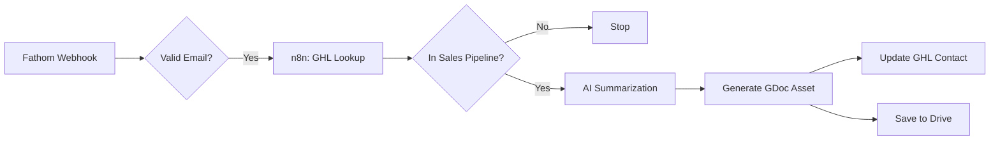

# SOP: Sales Call Automation Setup

## Overview
This automation listens for completed Fathom calls, qualifies them via GoHighLevel (GHL), summarizes them using AI, and generates a "D100 Sales Asset" (Google Doc) to help close the deal.

## Architecture


## Setup Instructions

### 1. n8n Workflow Deployment
**Option A: Auto-Deploy (Requires API Key)**
1.  Add `N8N_API_KEY=your_key` and `N8N_URL=https://sallc.app.n8n.cloud` to your `.env` file.
2.  Run: `python3 execution/deploy_n8n_flows.py`

**Option B: Manual Import**
1.  Download `delivery_frameworks/speed_to_lead/n8n_templates/07_Sales_Call_Automation.json`.
2.  Go to n8n -> Workflows -> **Import from File**.

### 2. Configuration
Once imported, open the workflow in n8n and configure:

1.  **Fathom Webhook**:
    *   Copy the Webhook URL from the n8n node.
    *   Go to Fathom -> Settings -> Webhooks.
    *   Add new Webhook for event: `call.completed`.
2.  **GHL Credentials**:
    *   Connect your GoHighLevel account in the "GHL Lookup" node.
3.  **Pipeline ID**:
    *   In the "In Sales Pipeline?" IF node, ensure the logic checks for the correct Pipeline ID (from your GHL URL).
4.  **Google Drive**:
    *   Connect Google Drive credentials.
    *   Set the `TEMPLATE_DOC_ID` in the "Create GDoc Asset" node to your "D100 Asset Template" file ID.

### 3. AI "Training" (The Golden Dataset)
**Critical Step**: To prevent the AI from generating bad copy, you must provide examples.
1.  Open the **AI Summarization** node in n8n.
2.  In the System Prompt, find `[INSERT GOLDEN DATASET HERE]`.
3.  Paste 1-3 examples in this format:
    ```text
    Example 1:
    Transcript: [Paste a snippet of a real call]
    Output: [Paste the perfect summary you wrote for that call]
    ###
    Example 2:
    Transcript: ...
    Output: ...
    ```

## Verification
1.  Book a test call on the specific Cal.com link (to ensure you are in the GHL Pipeline).
2.  Record a short dummy meeting on Fathom.
3.  End the meeting.
4.  Check n8n Executions -> Verify it ran green.
5.  Check GHL Contact Nodes -> Verify the Doc Link is there.
